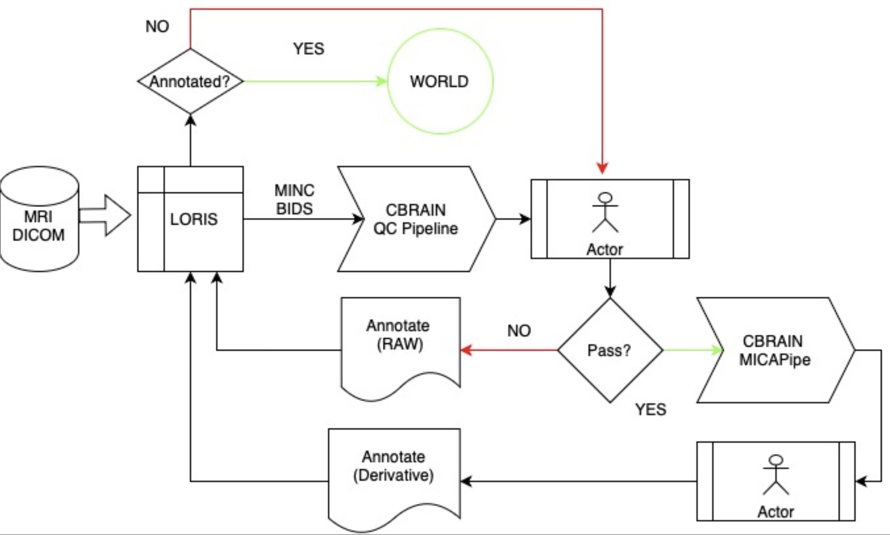

# Montréal Paris Neurobanque (MPN) 7T MRI Data Processing Pipeline

[](https://github.com/rcruces/7T_pipeline)
[](https://hub.docker.com/r/rcruces/7T_pipeline)
[](https://hub.docker.com/r/rcruces/7T_pipeline)
[](https://www.gnu.org/licenses/gpl-3.0)
[](https://github.com/rcruces/7T_pipeline/issues)
[](https://github.com/rcruces/7T_pipeline/stargazers)

## Overview

This repository hosts scripts and tools for processing and managing high-resolution 7T MRI data as part of the MPN initiative. The aim is to facilitate open data sharing and streamline quality control (QC) and preprocessing using an integrated pipeline that connects [LORIS](https://loris.ca/), [CBRAIN](https://cbrain.ca/), and [micapipe](https://micapipe.readthedocs.io/en/latest/), following  [BIDS standards](https://bids.neuroimaging.io/).

| <a href="https://loris.ca/"></a> | <a href="https://cbrain.ca/"></a> | [](https://micapipe.readthedocs.io/en/latest/) |
|:---:|:---:|:---:|
| Seamlessly manages raw and BIDS-formatted data, facilitating initial QC annotation. | Connects to LORIS to run QC and preprocessing tools, extracting and feeding back QC metrics and initial derivatives. | Performs standardized preprocessing of MRI data and generates derivatives. |


## Repository Contents

| **File**       | **Description**                                                                 |
|:--------------:|:--------------------------------------------------------------------------------|
| `README`       | Detailed documentation on the project's goals, setup instructions, and usage guidelines. |
| `LICENSE`      | Information on the repository's licensing terms for open-source distribution.   |
| `Dockerfile`   | Configuration to containerize the pipeline for reproducibility and easy deployment. |
| `Functions`    | Directory with the functions.                                                    |


## Workflow
The data processing workflow begins by transferring raw MRI data, in both BIDS and MINC format, to the `LORIS` platform. Once uploaded, initial quality control (QC) annotations are performed on `LORIS` using both automated tools and human evaluations. The data is then linked to `CBRAIN`, where automated QC metrics are extracted for further analysis. Following this, the QC reports on `LORIS` are reviewed and classified as either "pass" or "fail." Once the data is approved, it is transferred back to LORIS for preprocessing with `micapipe`. `micapipe` then generates initial derivatives while applying additional QC measures to ensure the integrity of the data throughout the entire pipeline.



## MRI transfering steps

### 1. DICOM Sorting: Organizes raw DICOM into a temporary structurated directories
```bash
dcmSort.sh
```

### 2. Sorted DICOM to NIfTI BIDS
```bash
mpn_sorted2bids.sh
```

### 3. Integrated BIDS validation
```python
from bids_validator import BIDSValidator
BIDSValidator().is_bids('path/to/mpn_rawdata')

```

### Running `micapipe v0.2.3` with container
```bash
micapipe_q1k.sh Q1K004 01 <path to singularity image>
```
# Naming convention
| **N** | **7T Terra Siemens acquisition**                | **BIDS**                            | **Directory** |
|:-----:|:-----------------------------------------------:|:-----------------------------------:|:-------------:|
|  1    | *anat-T1w_acq_mprage_0.8mm_CSptx                | T1w                                 | anat          |
|  2    | *anat-T1w_acq-mp2rage_0.7mm_CSptx_INV1          | inv-1_MP2RAGE                       | anat          |
|  3    | *anat-T1w_acq-mp2rage_0.7mm_CSptx_INV2          | inv-2_MP2RAGE                       | anat          |
|  4    | *anat-T1w_acq-mp2rage_0.7mm_CSptx_T1_Images     | T1map                               | anat          |
|  5    | *anat-T1w_acq-mp2rage_0.7mm_CSptx_UNI_Images    | UNIT1                               | anat          |
|  6    | *anat-T1w_acq-mp2rage_0.7mm_CSptx_UNI-DEN       | acq-DEN_UNIT1                       | anat          |
|  7    | *anat-flair_acq-0p7iso_UPAdia                   | FLAIR                               | anat          |
|  8    | *T2star_anat-T2star_acq-me_gre_0*7iso_ASPIRE    | T2starmap                           | anat          |
|  9    | *Romeo_Mask_anat-T2star_acq-me_gre_0c7iso_ASPIRE | acq-mask_T2starw                   | anat          |
|  10   | *Aspire_M_anat-T2star_acq-me_gre_0*7iso_ASPIRE  | acq-aspire_T2starw                  | anat          |
|  11   | *Aspire_P_anat-T2star_acq-me_gre_0*7iso_ASPIRE  | acq-aspire_part-phase_T2starw       | anat          |
|  12   | *EchoCombined_anat-T2star_acq-me_gre_0*7iso_ASPIRE | acq-EchoCombined_T2starw         | anat          |
|  13   | *sensitivity_corrected_mag_anat-T2star_acq-me_gre_0*7iso_ASPIRE | acq-SensitivityCorrectedMag_T2starw | anat       |
|  14   | *CLEAR-SWI_anat-T2star_acq-me_gre_0*7iso_ASPIRE | acq-ClearSWI_T2starw                | anat          |
|  15   | *anat-mtw_acq-MTON_07mm                        | mt-on_MTR                            | anat          |
|  16   | *anat-mtw_acq-MTOFF_07mm                       | mt-off_MTR                           | anat          |
|  17   | *anat-mtw_acq-T1w_07mm                         | acq-MTR_T1w                          | anat          |
|  18   | *anat-nm_acq-MTboost_sag_0.55mm                | acq-neuromelanin_MWFmap              | anat          |
|  19   | *anat-angio_acq-tof_03mm_inplane               | acq-tof_angio                        | anat          |
|  20   | *anat-angio_acq-tof_03mm_inplane_MIP_SAG       | acq-tofSag_angio                  | anat          |
|  21   | *anat-angio_acq-tof_03mm_inplane_MIP_COR       | acq-tofCor_angio                  | anat          |
|  22   | *anat-angio_acq-tof_03mm_inplane_MIP_TRA       | acq-tofTra_angio                  | anat          |
|  23   | *func-cloudy_acq-ep2d_MJC_19mm                 | task-cloudy_bold                     | func          |
|  24   | *func-cross_acq-ep2d_MJC_19mm                  | task-cross_bold                      | func          |
|  25   | *func-semphon1_acq-mbep2d_ME_19mm              | task-semphon1_bold                   | func          |
|  26   | *func-semphon2_acq-mbep2d_ME_19mm              | task-semphon2_bold                   | func          |
|  27   | *func-rsfmri_acq-multiE_1.9mm                  | task-rest_bold                       | func          |
|  28   | *Romeo_P_anat-T2star_acq-me_gre_0*7iso_ASPIRE   | acq-romeo_S0map                     | fmap          |
|  29   | *Romeo_B0_anat-T2star_acq-me_gre_0*7iso_ASPIRE  | acq-romeoB0_S0map                   | fmap          |
|  30   | *fmap-b1_tra_p2                                | acq-anatTra_TB1TFL                   | fmap          |
|  31   | *fmap-b1_acq-sag_p2                            | acq-anatSag_TB1TFL                   | fmap          |
|  32   | *fmap-fmri_acq-mbep2d_SE_19mm_dir-AP           | dir-AP_epi                           | fmap          |
|  33   | *fmap-fmri_acq-mbep2d_SE_19mm_dir-PA           | dir-PA_epi                           | fmap          |
|  34   | *dwi_acq_b0_PA                                 | acq-b0_dir-PA_dwi                    | dwi           |
|  35   | *dwi_acq_b0_PA_SBRef                           | acq-b0_dir-PA_sbref                  | dwi           |
|  36   | *dwi_acq_multib_38dir_AP_acc9                  | acq-multib38_dir-AP_dwi              | dwi           |
|  37   | *dwi_acq_multib_38dir_AP_acc9_SBRef            | acq-multib38_dir-AP_sbref            | dwi           |
|  38   | *dwi_acq_multib_70dir_AP_acc9                  | acq-multib70_dir-AP_dwi              | dwi           |
|  39   | *dwi_acq_multib_70dir_AP_acc9_SBRef            | acq-multib70_dir-AP_sbref            | dwi           |


# Requirements

| **Package**       |  **Version**  |
|:-----------------:|:-------------:|
| python            |  3.8          |
| dcm2niix          |  1.0.20240202 |
| jq                |  1.6          |
| bids_validator    |  2.0.0        |
| deno              |  2.0.6        |
